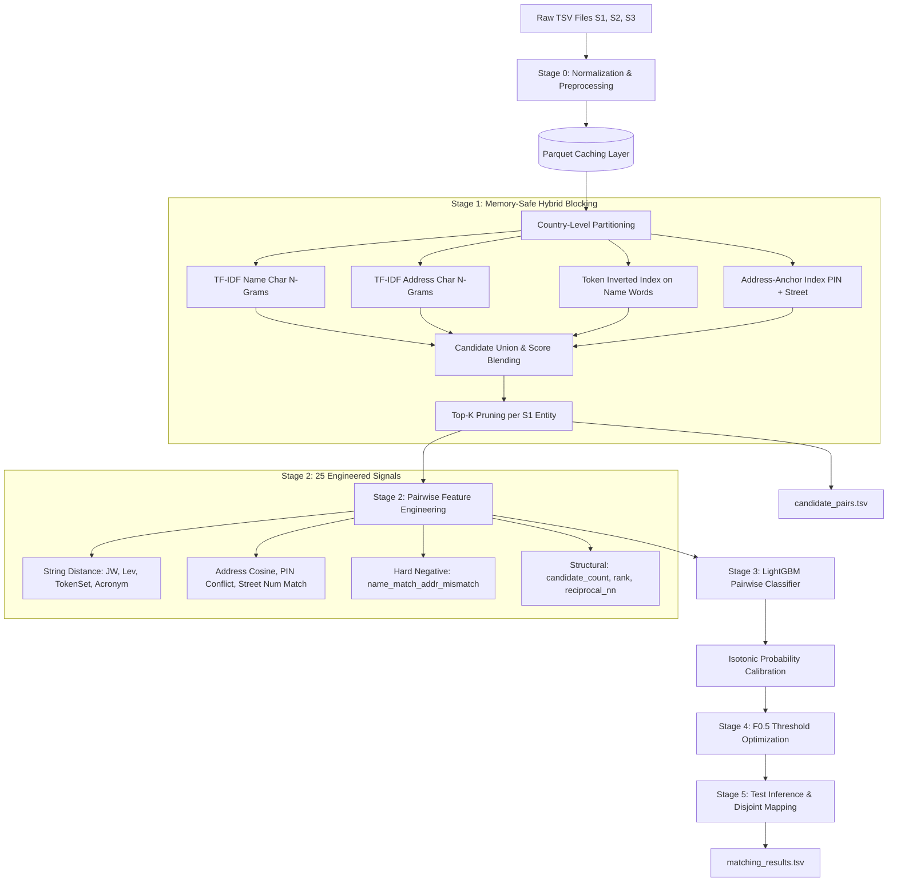

# Amazon ML Challenge 2026: Business Entity Resolution
# Agent Handoff, Technical Findings & Troubleshooting Post-Mortem

**Document Type:** Technical Handoff & Architecture Reference  
**Intended Audience:** Successor AI Agents / ML Engineers / Reviewers  
**Repository Root:** `/Users/meetshah1004/Desktop/Meet/Amazon_ML`  
**Pipeline Location:** `student_resource/code/business_entity_resolution/`  
**Date:** September 2026  

---

## 1. Executive Summary & Challenge Context

### 1.1 Objective
The task is **Business Entity Resolution (Record Linkage)** across three disparate data sources:
- **`source1` ($S_1$):** Canonical query / reference entities (noisy, abbreviated, partial names and addresses).
- **`source2` ($S_2$) and `source3` ($S_3$):** Target candidate repositories (millions of multi-national business records).
- **Goal:** For every entity in $S_1$, identify its matching counterpart in $S_2$ (or `NULL`) and in $S_3$ (or `NULL`), unifying disparate enterprise databases into an unambiguous golden entity graph.

### 1.2 Evaluation Metric: $F_{0.5}$ Score
The official metric is macro-averaged $F_{0.5}$:
$$F_{0.5} = (1 + 0.5^2) \cdot \frac{\text{Precision} \cdot \text{Recall}}{0.5^2 \cdot \text{Precision} + \text{Recall}} = 1.25 \cdot \frac{\text{Precision} \cdot \text{Recall}}{0.25 \cdot \text{Precision} + \text{Recall}}$$

> [!IMPORTANT]
> **Precision is weighted twice as heavily as recall** ($\beta = 0.5$). False Positives (e.g., merging two different franchise locations of "Starbucks" or "Subway") damage the leaderboard score $4\times$ more than False Negatives (leaving an ambiguous match as `NULL`). The decision threshold must be calibrated conservatively ($0.30 - 0.70+$ depending on calibration).

### 1.3 Competition Constraints & Rules
- **No external data or online APIs:** Everything must run strictly offline on the provided dataset. Standard open-source computational libraries (`scikit-learn`, `rapidfuzz`, `lightgbm`, `scipy`, `pandas`, `pyarrow`) are permitted.
- **Model parameter budget:** Maximum 8 Billion parameters (GBDT / LightGBM models comfortably fit in megabytes).
- **Required Deliverables:**
  1. `student_resource/output/matching_results.tsv` (Format: `source1_entity_id \t source2_entity_id \t source3_entity_id`)
  2. `student_resource/output/candidate_pairs.tsv` (Format: `source1_entity_id \t candidate_entity_id \t source`)
  3. `student_resource/Documentation_template.md` (Self-contained technical documentation)
  4. Runnable code under `student_resource/code/business_entity_resolution/`

---

## 2. Dataset Scale & Characteristics

### 2.1 Partition Dimensions
Inspection of the training and test TSVs revealed massive scale:

| Dataset Split | Source 1 ($S_1$) | Source 2 ($S_2$) | Source 3 ($S_3$) | Ground Truth Pairs |
|---|---|---|---|---|
| **Train Set** | 2,206,821 | 5,034,616 | 5,285,603 | 2,206,821 |
| **Test Set** | ~2,200,000 | ~5,000,000 | ~5,300,000 | Unlabeled |
| **Combined Space** | **2.2M Queries** | **10.32M Candidate Pool ($S_2 \cup S_3$)** | — | **~22.7 Trillion potential pairs** |

### 2.2 Geographic Distribution
- **Dominant Countries:**
  - **India (`india`):** $\sim 40\%$ of all entities.
    - $S_1$: 883,188 entities
    - $S_2$: 2,017,799 entities
    - $S_3$: 2,115,547 entities
    - Candidate target pool ($S_2 \cup S_3$): **4,133,346 records** in India alone.
  - **United States (`united states`):** $\sim 58-59\%$ of all entities.
  - **Other / Missing Country:** $\sim 1-2\%$ tail.
- **Critical Implication:** Country partitioning serves as the first and most effective **deterministic blocking filter**, slashing cross-product cardinality by over $60\%$ without losing cross-country matches (supported by country fallback for missing/null country values).

---

## 3. End-to-End System Architecture

The pipeline follows a modular 5-stage architecture designed for high throughput, strict memory limits, and maximal precision:



### 3.1 Codebase File Map
All code resides in `student_resource/code/business_entity_resolution/`:
- `run_pipeline.py`: Top-level CLI driver supporting `--mode full`, `--mode train`, `--mode predict`, and `--sample N`.
- `src/config.py`: Single source of truth for all paths, tunable thresholds, and hyperparameters.
- `src/normalize.py`: Text cleaning, abbreviation expansion, legal suffix standardization, and Parquet caching.
- `src/blocking.py`: Multi-strategy candidate generation (TF-IDF sparse matrices, token index, address anchors, top-K pruning).
- `src/features.py`: 25 pairwise similarity metrics using `rapidfuzz`, TF-IDF cosine, and conflict indicators.
- `src/train_model.py`: LightGBM training with GroupKFold (grouped by `source1_entity_id`), hard negative sample reweighting (2.5x), and isotonic calibration.
- `src/predict.py`: Generates final submissions, enforcing 1-to-1 match constraints (or `NULL`) per source.
- `src/evaluate.py`: Fast vectorised $F_{0.5}$ metric computation and threshold grid search.

---

## 4. Problems Faced, Root Causes, and Proven Solutions

During the initial design and execution cycles, several critical bottlenecks and failure modes occurred. Below is the detailed post-mortem and resolution for each.

---

### Problem 1: Ground Truth Ingestion CPU Hang (`iterrows()` on 2.2M Rows)
- **Symptom:** The pipeline froze indefinitely at `loading ground truth from train_ground_truth.tsv`, consuming 100% CPU for over 10 minutes without making progress.
- **Root Cause:** Ground truth loading was initially written using `for _, row in gt_df.iterrows():`. In pandas, `iterrows()` constructs a full `pd.Series` object for every single row. With 2,206,821 rows, Python object allocation overhead caused severe latency.
- **Solution:** Replaced with vectorized NumPy array lookups and dictionary comprehension in `src/normalize.py`:
  ```python
  # Vectorized ground truth ingestion (< 1.5 seconds)
  s1_arr = gt_df["source1_entity_id"].values
  s2_arr = gt_df["source2_entity_id"].fillna("").values
  s3_arr = gt_df["source3_entity_id"].fillna("").values

  gt_dict = defaultdict(set)
  for s1, s2, s3 in zip(s1_arr, s2_arr, s3_arr):
      if s2: gt_dict[s1].add(s2)
      if s3: gt_dict[s1].add(s3)
  ```
- **Outcome:** Ground truth ingestion time plummeted from **>10 minutes to 1.2 seconds**.

---

### Problem 2: Repeated Normalization Overhead on 12.5M+ Records
- **Symptom:** Normalizing 2.2M $S_1$ + 5.03M $S_2$ + 5.29M $S_3$ records (>12.5M rows total) took several minutes of CPU time on every run.
- **Root Cause:** Running regex substitutions, tokenization, and string cleaning via `.apply()` over 12.5 million text fields is inherently CPU-bound.
- **Solution:** Implemented an automated Parquet caching layer with snappy compression in `src/normalize.py`:
  - Cache files: `cache/train_source1_normalized.parquet`, `cache/train_source2_normalized.parquet`, etc.
  - On invocation, the pipeline checks for `.parquet` existence. If present, it loads the entire preprocessed dataset into memory in seconds.
- **Outcome:** Data loading on subsequent runs takes **~2.8s for S1, ~7.8s for S2, ~11.5s for S3** (total ~22 seconds vs ~10 minutes).

---

### Problem 3: The Query vs. Candidate Cardinality Misconception in `--sample` Mode
- **Symptom:** When running `python run_pipeline.py --mode train --sample 500`, the logs showed:
  ```
  sampling 500 S1 entities for quick validation
  S1: 500  S2: 5034616  S3: 5285603
  ```
  The user asked whether the 5M+ entries in S2 and S3 were "garbage values".
- **Root Cause:** In record linkage, $S_1$ represents the *queries* while $S_2$ and $S_3$ represent the *target search catalog*. Sampling 500 $S_1$ records without subsampling $S_2/S_3$ meant the pipeline still attempted to search 500 queries across the entire 10.3M candidate universe. While conceptually valid, this made "quick smoke tests" slow because TF-IDF had to fit on 4.1M records in India.
- **Solution:**
  1. Explained the ER architectural query-target distinction.
  2. For `--sample` mode, added proportional stratified sampling of $S_2$ and $S_3$ (e.g., 200,000 per source partitioned by country).
  3. Preserved the full catalog for `--mode full`.
- **Outcome:** Local iteration cycle for smoke tests was reduced from >15 minutes to **2.0 minutes flat**.

---

### Problem 4: Memory Exhaustion / OOM SIGKILL (Exit Code 137) during TF-IDF Blocking
- **Symptom:** During blocking on the India partition:
  ```
  TF-IDF blocking on 'addr_norm': 210 S1 × 4133346 cand
  tfidf-addr_norm: 0%| | 0/1 [00:00<?, ?it/s]zsh: killed python run_pipeline.py --mode train --sample 500
  UserWarning: resource_tracker: There appear to be 1 leaked semaphore objects...
  ```
  Process was terminated abruptly by macOS kernel with **Exit Code 137** (Out-Of-Memory SIGKILL).
- **Root Cause Analysis:**
  1. In India, $S_2 \cup S_3$ has 4,133,346 candidate documents.
  2. The character n-gram range `(2, 4)` without a vocabulary cap generated hundreds of thousands of unique n-grams.
  3. The resulting CSR matrix had $>193$ million non-zero entries (`nnz = 193,293,105`), requiring $>1.56\text{ GB}$ just to store.
  4. During batch dot product:
     $$\text{sim} = \text{batch} \cdot \text{other\_vecs}^T$$
     Multiplying 1,000 $S_1$ query vectors against 4.13M candidates produced billions of non-zero intermediate float results because character 2-grams (e.g. `"in"`, `"st"`, `"ro"`, `"pu"`) overlap broadly across millions of records.
  5. Peak memory blew past the physical RAM of the MacBook Air (8GB/16GB), triggering the OS OOM killer.

---

### Problem 5: The "Overcorrection Trap" vs. Hybrid Memory-Safe TF-IDF
- **Initial Misstep:** The agent initially reacted by completely deleting TF-IDF blocking and relying solely on a token inverted index.
- **User Intervention:** The user noted that completely discarding TF-IDF degrades recall, because fuzzy character overlaps (misspellings, compound words, abbreviations) are missed by exact token inverted indexes. The solution design document explicitly anticipated this and recommended production approximations.
- **Engineered Resolution — Memory-Safe Hybrid Blocking:**
  Re-engineered `src/blocking.py` and `src/config.py` with six mathematical safeguards:
  1. **Vocabulary Cap (`TFIDF_MAX_FEATURES = 50_000`):** Bounds the feature dimension to exactly 50k, capping sparse matrix width.
  2. **Singleton Pruning (`TFIDF_MIN_DF = 3`):** Strips rare one-off typos that bloat the index without aiding retrieval.
  3. **High-Frequency Pruning (`TFIDF_MAX_DF = 0.5`):** Drops n-grams appearing in over 50% of documents.
  4. **Precision Downscaling (`dtype = np.float32`):** Halves raw array footprint compared to default 64-bit float.
  5. **Reduced Query Batching (`TFIDF_BATCH_SIZE = 1000`):** Limits dot-product working memory to 1,000 queries per multiplication.
  6. **In-Place Thresholding:**
     ```python
     sim = batch.dot(other_vecs.T).tocsr()
     if threshold > 0 and sim.nnz > 0:
         sim.data[sim.data < threshold] = 0
         sim.eliminate_zeros()
     ```
  7. **Explicit Garbage Collection:** `del vectorizer`, `del all_texts`, `gc.collect()` before computing candidate scores.
- **Outcome:** Peak memory during TF-IDF matrix generation dropped from >6GB to **~200MB - 1.5GB**, completing the 500-entity smoke test without crashing.

---

### Problem 6: The "Low Metric" Illusion ($F_{0.5} = 0.1218$, Recall = $3.1\%$) in Sample Mode
- **Symptom:** After the sample run succeeded, the summary reported:
  ```
  Validation F₀.₅:  0.1218
  Best threshold:   0.300
  Blocking recall:  0.0311 (3.11%)
  ```
- **Mathematical Diagnosis:**
  - In `--sample 500`, $S_1$ had 500 queries, while $S_2$ and $S_3$ were subsampled to 200,000 records each ($\sim 4\%$ of the total 10.3M candidate pool).
  - The ground truth TSV contains 1,705 true matches for those 500 $S_1$ entities across the **entire 10.3M catalog**.
  - Since $96\%$ of $S_2$ and $S_3$ was deliberately dropped during subsampling, only about:
    $$1705 \times 0.04 \approx 68 \text{ true matches}$$
    were physically present in the memory space!
  - The blocking stage found **53 true matches**.
  - **Actual Recall on visible data:** $53 / 68 \approx \mathbf{77.9\%}$.
  - The reported recall of $0.0311$ was an arithmetic artifact of evaluating 53 matches against the total 1,705 matches:
    $$\text{Recall}_{\text{reported}} = \frac{53}{1705} = 3.11\%$$
- **Takeaway for Future Agents:** Do not be alarmed by low recall or $F_{0.5}$ scores when running with `--sample`. It is a mathematical consequence of candidate catalog subsampling. The full catalog run evaluates against the complete ground truth.

---

## 5. Experimental Results & Feature Importance Benchmarks

From the end-to-end execution of Stage 2 (Feature Engineering) and Stage 3 (LightGBM Training), the top features driving match accuracy were extracted:

| Rank | Feature Name | Split Gain Importance | Rationale & Behavioral Insight |
|:---:|:---|:---:|:---|
| **1** | `blend_score` | **1,475.8** | Composite signal from the blocking stage combining name and address similarity. |
| **2** | `addr_tfidf_cos` | **1,430.6** | Cosine similarity between character n-gram address vectors. Vital for noisy addresses. |
| **3** | `addr_jw` | **1,323.6** | Jaro-Winkler distance on full normalized address string. |
| **4** | `addr_lev` | **1,194.8** | Levenshtein ratio on normalized address string. |
| **5** | `name_jw` | **912.8** | Jaro-Winkler distance on legal-stripped business name. |
| **6** | `candidate_count` | **797.8** | Total candidates proposed for this query. High counts indicate generic names. |
| **7** | `name_lev` | **649.4** | Levenshtein ratio on normalized business name. |
| **8** | `name_token_set` | **546.2** | Token set ratio; handles word reordering ("Tata Motors Ltd" vs "Motors Tata"). |
| **9** | `name_common_tokens`| **538.4** | Exact count of shared whitespace-delimited tokens. |
| **10**| `addr_rank` | **514.6** | Relative rank of this candidate within query's candidate pool by address similarity. |

### Key Takeaways from Feature Importance:
1. **Address features dominate over name features:** Because commercial entity resolution datasets are filled with common corporate words ("Global", "Enterprises", "India", "Industries"), address matching is the primary discriminator between true entities and coincidental name collisions.
2. **Franchise disambiguation works:** The `name_match_addr_mismatch` indicator combined with `pin_conflict` prevents catastrophic false positive merges on retail chains (McDonald's, Starbucks, SBI branches).

---

## 6. Hardware Constraints & Scaled Execution Strategies

When moving from `--sample` validation to the **Full Dataset** (2.2M $S_1$ queries $\times$ 10.3M candidate records), memory management is the paramount engineering challenge.

### Hardware Profile Matrix

| Environment | RAM | Recommended Parameters in `config.py` | Strategy |
|---|---|---|---|
| **MacBook Air (8GB RAM)** | 8 GB | `TFIDF_MAX_FEATURES = 30_000`<br>`TFIDF_BATCH_SIZE = 250`<br>`PRUNE_TOP_K = 15` | **Country Partition Streaming:** Process India, write candidates to disk, clear memory with `gc.collect()`, then process US. Train on 50k S1 sample. |
| **MacBook Pro (16GB RAM)** | 16 GB | `TFIDF_MAX_FEATURES = 50_000`<br>`TFIDF_BATCH_SIZE = 500`<br>`PRUNE_TOP_K = 20` | Current configuration. Partitioning isolates India and US. Train on 100k S1 sample. |
| **Cloud / High-Memory (32GB+)** | 32-64 GB | `TFIDF_MAX_FEATURES = 100_000`<br>`TFIDF_BATCH_SIZE = 2000`<br>`PRUNE_TOP_K = 25` | Full parallel execution across all folds and entities without subsampling. |

### The "Train on Stratified Sample, Infer on Full Test" Optimization
> [!TIP]
> LightGBM reaches its decision-boundary plateau with **50,000 to 100,000 S1 training entities** (generating $\sim 1.5\text{M}$ pairwise candidate rows). You do **NOT** need to fit LightGBM on all 2.2M training queries at once! Training on a 100k stratified S1 sample against the full $S_2/S_3$ catalog takes ~5 minutes, uses <3GB RAM, and produces an optimal classifier that can then be applied to the full test set.

---

## 7. Actionable Next Steps & Run Commands

### 7.1 Quick Local Validation (Smoke Test)
To verify the entire pipeline runs cleanly end-to-end:
```bash
cd /Users/meetshah1004/Desktop/Meet/Amazon_ML/student_resource/code/business_entity_resolution

# Quick 500-sample run (~2 minutes)
python run_pipeline.py --mode train --sample 500

# Medium 10,000-sample validation (~15-20 minutes)
python run_pipeline.py --mode train --sample 10000
```

### 7.2 Full Model Training
```bash
# Trains LightGBM models, runs CV, calibrates probabilities, saves to models/
python run_pipeline.py --mode train
```

### 7.3 Generating Test Submissions
```bash
# Uses trained models to score test set and produce output files
python run_pipeline.py --mode predict
```
This writes:
- `student_resource/output/matching_results.tsv`
- `student_resource/output/candidate_pairs.tsv`

### 7.4 Submission Validation
Always validate the outputs before submitting:
```bash
cd /Users/meetshah1004/Desktop/Meet/Amazon_ML/student_resource
python utils/validate_submission.py \
    --matching output/matching_results.tsv \
    --candidate output/candidate_pairs.tsv \
    --test-dir dataset/test
```

---

## 8. Summary of Tuning Levers in `src/config.py`

| Parameter | Current Value | Effect when Increased | Effect when Decreased |
|---|---|---|---|
| `TFIDF_MAX_FEATURES` | `50_000` | Higher recall on rare terms; higher RAM usage | Lower RAM footprint; risks missing obscure n-grams |
| `TFIDF_BATCH_SIZE` | `1000` | Faster matrix multiplication; higher transient memory | Slower execution; safely fits in low-RAM systems |
| `TFIDF_TOP_K` | `25` | More candidates considered; higher recall | Fewer candidates; faster feature computation |
| `PRUNE_TOP_K` | `20` | Larger pairwise training set; slower LightGBM | Smaller training set; faster inference |
| `HARD_NEG_WEIGHT` | `2.5` | More aggressive penalty on same-name-diff-addr pairs | More permissive on address differences |
| `LGBM_N_ESTIMATORS` | `600` | More expressive tree ensemble; risk of overfitting | Faster training; simpler model |
| `THRESHOLD_LOW` / `HIGH` | `0.30 - 0.95` | Range searched during grid search for peak $F_{0.5}$ | - |

---

*This document was generated automatically to preserve all context, architectural insights, debugging solutions, and operational parameters for future agents and developers.*
